# Homework 1 (100 Points)

## Student Information
**Name:** Yang Xu  
**Student ID:** 801443244  
**Homework Number:** 1  

## GitHub Repository
[https://github.com/xuy50/ecgr5106-hw1](https://github.com/xuy50/ecgr5106-hw1)

---

## Problem 1: Multi-Layer Perceptron for CIFAR-10

### 1.a Training from Scratch
I implemented a multi-layer perceptron (MLP) with three hidden layers and trained it from scratch on the CIFAR-10 dataset. The training results for 20 epochs and 100 epochs are shown below:

#### Training and Validation Results (3-Layer MLP)
- **20 Epochs:** Train Loss: **1.4112**, Train Acc: **0.4955**, Test Loss: **1.5260**, Test Acc: **0.4642**
- **100 Epochs:** Train Loss: **1.1130**, Train Acc: **0.6031**, Test Loss: **1.6629**, Test Acc: **0.4796**

#### Evaluation Metrics
| Epochs | Precision | Recall | F1 Score |
|--------|-----------|--------|----------|
| 20     | 0.4873    | 0.4642 | 0.4542   |
| 100    | 0.4842    | 0.4796 | 0.4764   |

#### Training and Validation Loss & Accuracy
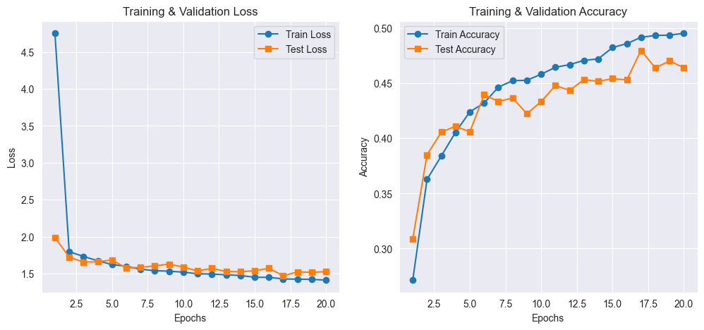
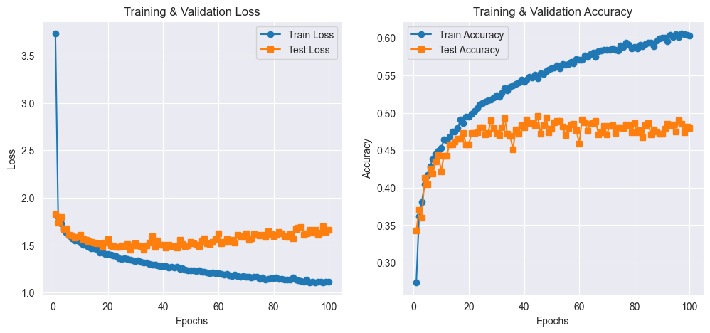

#### Confusion Matrix (20 Epochs)
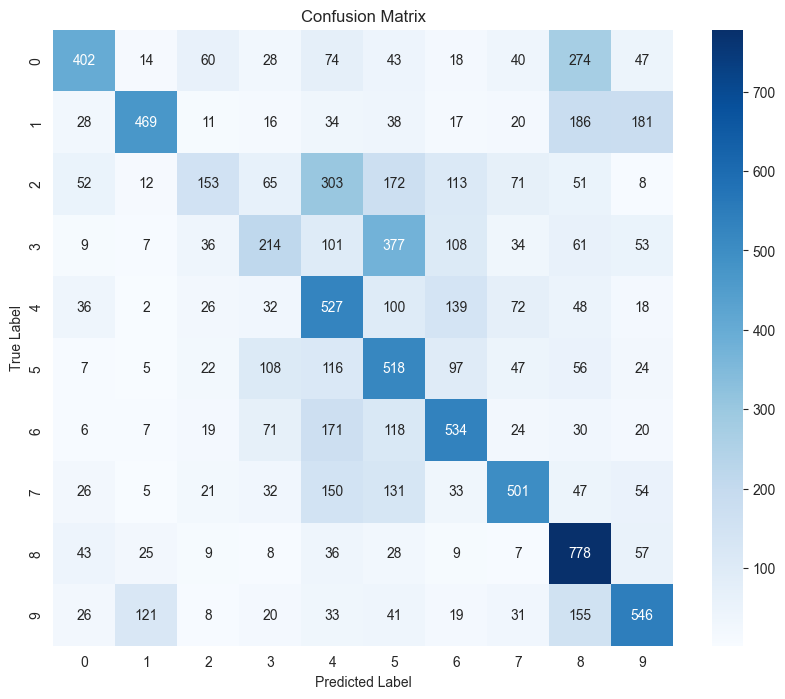

**Observations:**
- The network shows slight overfitting after around 20 epochs, so I think it achieves full training within 20 epochs.
- Increasing epochs leads to better training accuracy, but validation performance does not improve significantly.
- The model achieves reasonable performance but struggles with generalization.

### 1.b Increasing Network Complexity
I tested models with 4 and 5 hidden layers to analyze the effect of network depth on performance.

#### Training and Validation Results
| Model  | Epochs | Train Loss | Train Acc | Test Loss | Test Acc |
|--------|--------|------------|-----------|-----------|-----------|
| 4-Layer | 20    | 1.3201     | 0.5292    | 1.4888    | 0.4698    |
| 4-Layer | 100   | 0.8533     | 0.6976    | 1.9120    | 0.4909    |
| 5-Layer | 20    | 1.2729     | 0.5445    | 1.4969    | 0.4854    |
| 5-Layer | 100   | 0.4833     | 0.8365    | 2.9720    | 0.4582    |

#### Evaluation Metrics
| Model  | Epochs | Precision | Recall | F1 Score |
|--------|--------|-----------|--------|----------|
| 4-Layer | 20    | 0.4880    | 0.4698 | 0.4714   |
| 4-Layer | 100   | 0.5024    | 0.4909 | 0.4891   |
| 5-Layer | 20    | 0.4886    | 0.4854 | 0.4782   |
| 5-Layer | 100   | 0.4621    | 0.4582 | 0.4565   |

#### Training and Validation Loss & Accuracy (4-Layer)
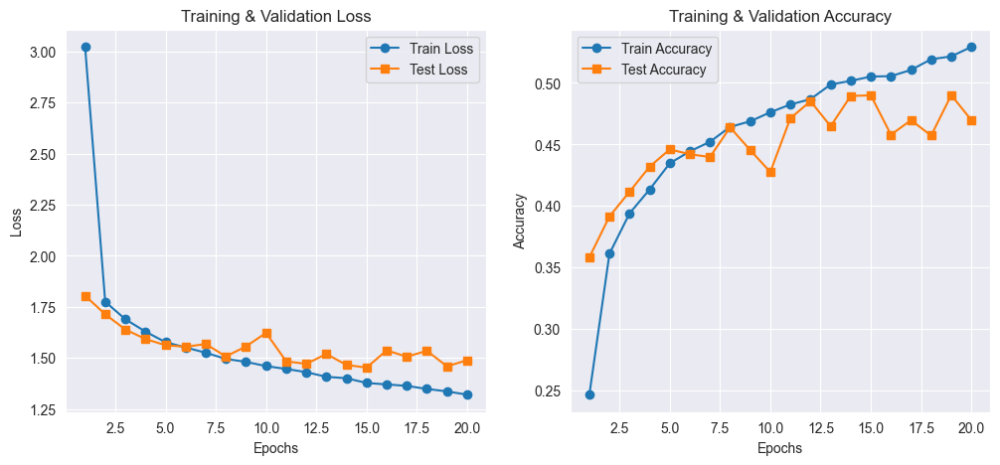
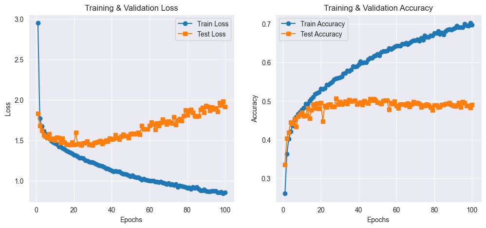

#### Training and Validation Loss & Accuracy (5-Layer)
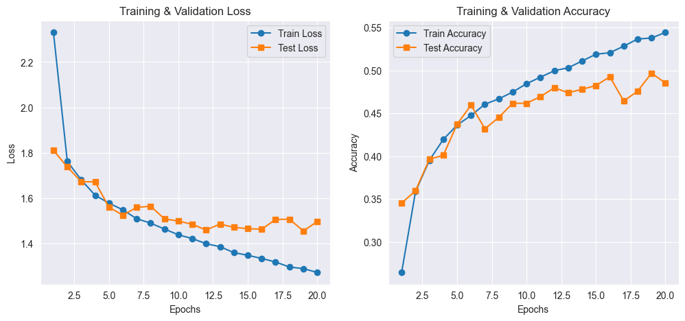
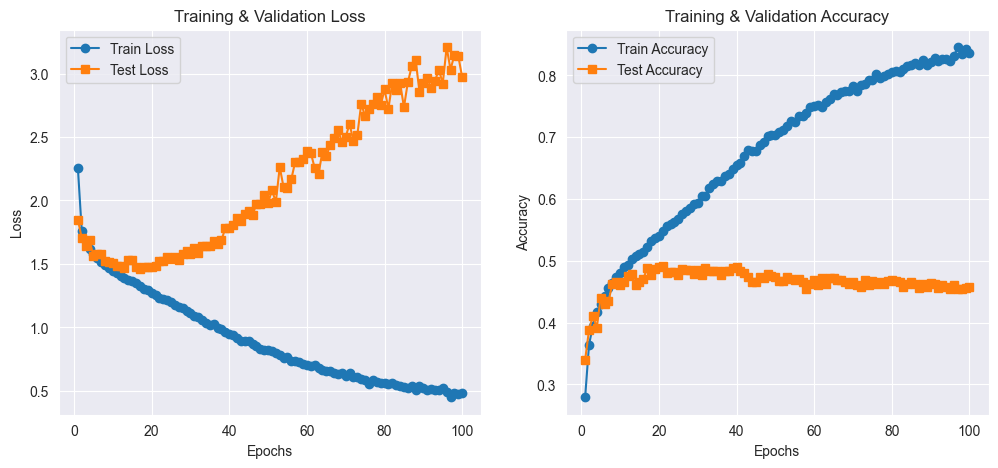

#### Confusion Matrices (20 Epochs)
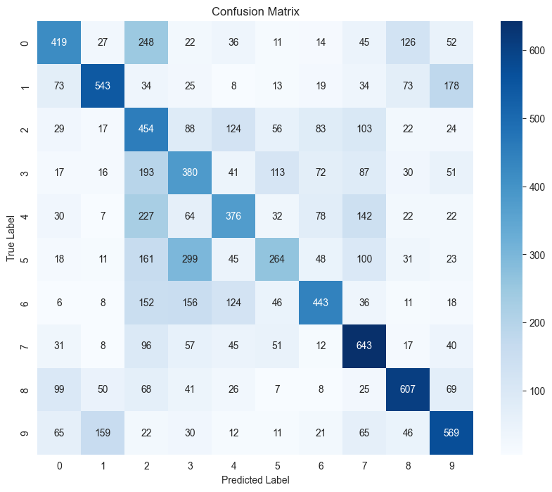
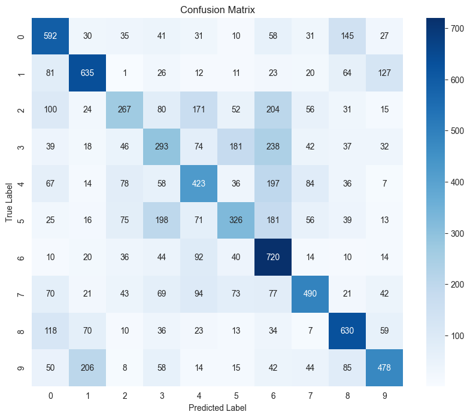

**Observations:**
- Increasing depth slightly improves early training performance but leads to noticeable overfitting after 20 epochs.
- The 4-layer & 5-layer model performs well on training data but generalizes poorly, with a significant increase in test loss.
- Overfitting starts appearing in all models after approximately 20 epochs, indicating that the network has already reached full training by this point.

#### Conclusion
- A 3-layer MLP provides a good balance between accuracy and generalization.
- Increasing depth beyond 3 layers leads to diminishing returns and more overfitting.
- Overfitting becomes noticeable after 20 epochs in all cases, confirming that the network has already achieved full training and further training does not provide significant benefits.

---

## Problem 2: Multi-Layer Perceptron for Housing Price Regression

### 2.a Training without One-Hot Encoding
I implemented a multi-layer perceptron (MLP) to predict housing prices using a standard dataset without one-hot encoding for categorical features. The training and validation results for 60 and 100 epochs are shown below:

#### Training and Validation Results (Without One-Hot Encoding)
- **60 Epochs:** MSE: **0.29**, MAE: **0.41**, R²: **0.64**
- **100 Epochs:** MSE: **0.30**, MAE: **0.42**, R²: **0.62**

#### Model Complexity
- Hidden layers: **[64, 32]**
- Total trainable parameters: **2945**

#### Training and Validation Loss & R²
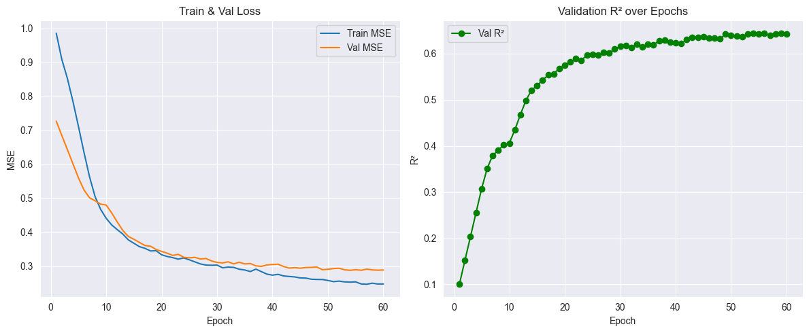
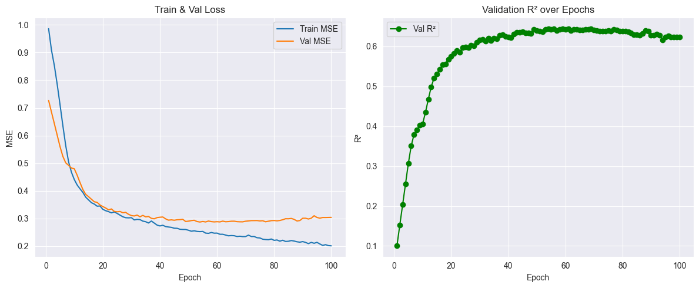

**Observations:**
- The model shows slight overfitting after **60 epochs**, meaning training beyond this does not yield significant validation improvement.

### 2.b Training with One-Hot Encoding
Next, I trained an MLP using one-hot encoding for categorical features. The training and validation results for 60 and 100 epochs are:

#### Training and Validation Results (With One-Hot Encoding)
- **60 Epochs:** MSE: **0.29**, MAE: **0.42**, R²: **0.65**
- **100 Epochs:** MSE: **0.31**, MAE: **0.43**, R²: **0.62**

#### Model Complexity
- Hidden layers: **[64, 32]**
- Total trainable parameters: **3073**

#### Training and Validation Loss & R²
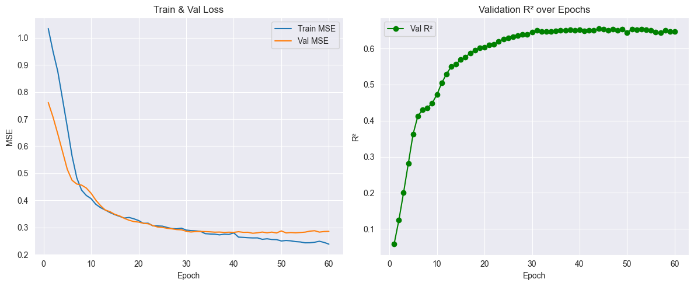
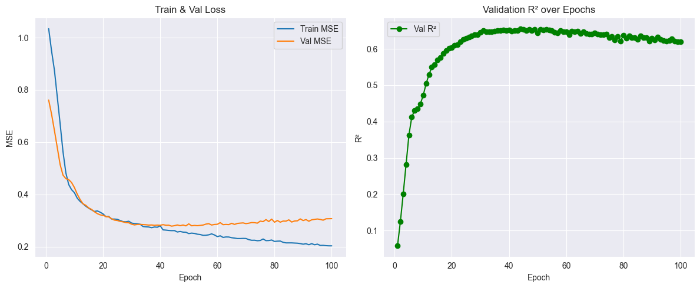

**Observations:**
- One-hot encoding slightly improves performance (**R² increased from 0.64 to 0.65** in 60 epochs).
- Overfitting starts appearing after **60 epochs**.
- The improvement from one-hot encoding is relatively small, possibly because the instance and the network structure are not highly complex, limiting the impact of additional categorical feature representation.

### 2.c Increasing Model Complexity
I experimented with increasing network complexity by adding more layers and neurons.

#### Training and Validation Results (3-Layer Network)
- **50 Epochs:** MSE: **0.30**, MAE: **0.42**, R²: **0.63**
- **60 Epochs:** MSE: **0.32**, MAE: **0.42**, R²: **0.60**

#### Model Complexity
- Hidden layers: **[128, 64, 32]**
- Total trainable parameters: **12289**

#### Training and Validation Loss & R²
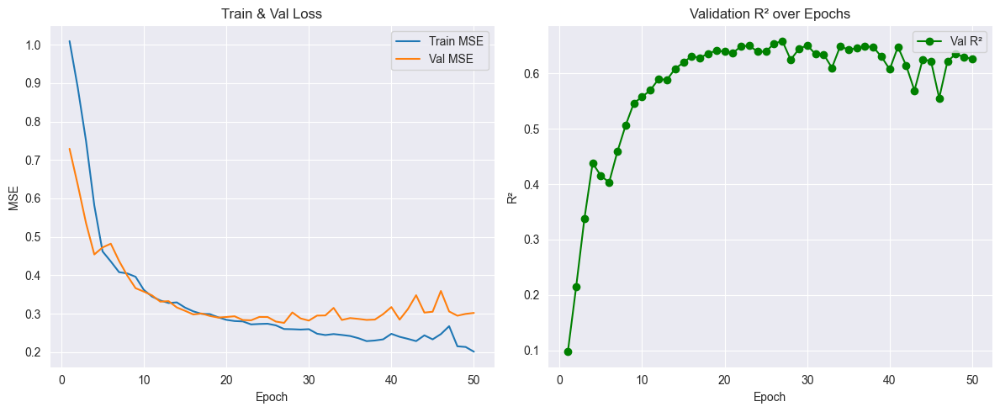
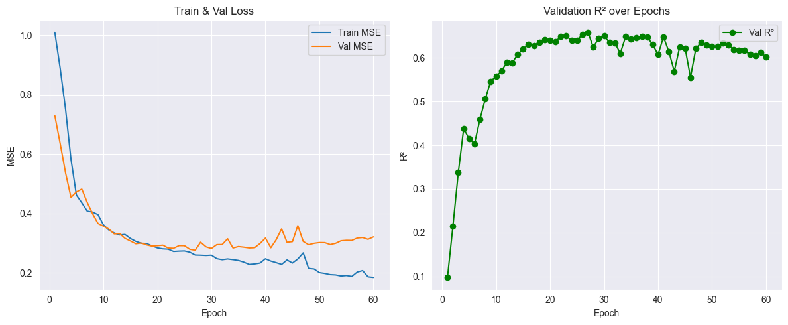

**Observations:**
- Overfitting appears **after 50 epochs**, meaning deeper networks require earlier stopping.

#### Training and Validation Results (4-Layer Network)
- **28 Epochs:** MSE: **0.30**, MAE: **0.41**, R²: **0.63**
- **60 Epochs:** MSE: **0.38**, MAE: **0.44**, R²: **0.53**

#### Model Complexity
- Hidden layers: **[256, 128, 64, 32]**
- Total trainable parameters: **47105**

#### Training and Validation Loss & R²
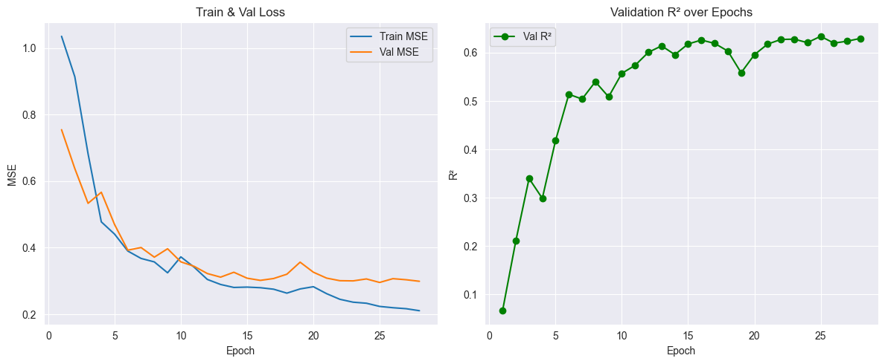
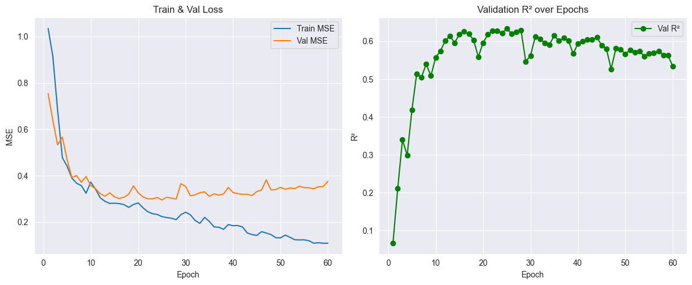

**Observations:**
- Overfitting starts appearing earlier (**after 28 epochs**).
- Increasing depth **does not significantly improve performance**, and actually reduces generalization beyond **60 epochs**.

#### Conclusion
- One-hot encoding improves model performance slightly but does not drastically change results, possibly due to the relatively simple instance and network architecture.
- Increasing network complexity leads to earlier overfitting, suggesting **smaller architectures may be better for this dataset**.
- The best balance of performance and generalization occurs **at 60 epochs** for 2.a and 2.b, and **around 28-50 epochs** for 2.c.

---